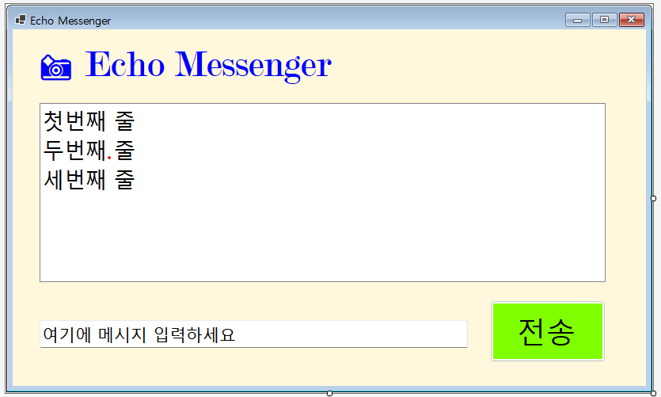
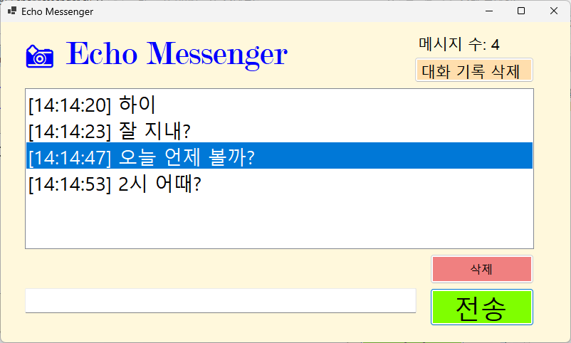
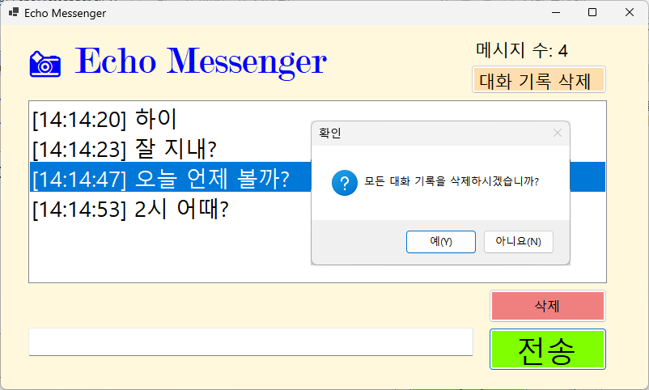
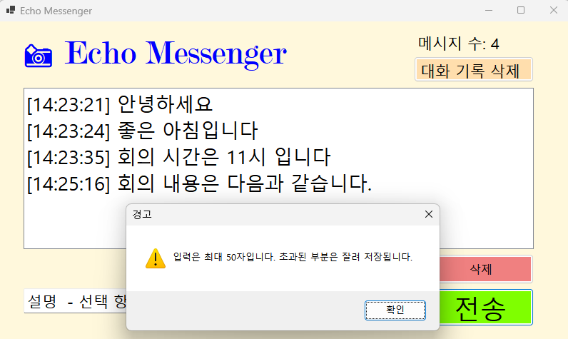

# (C# 코딩) 에코 메신저 

## 개요
- C# 프로그래밍 학습
- 1줄 소개: 사용자 키보드 입력을 받아서 처리하는 프로그램 
- 사용한 플랫폼: 
  - C#, .NET Windows Forms, Visual Studio, GitHub
- 사용한 컨트롤:
  - Label, TextBox, ListBox, Button 
- 사용한 기술과 구현한 기능:
  - Visual Studio를 이용하여 UI 디자인 
  - string 클래스를 이용한 사용자 입력 데이터 처리
  - DateTime 클래스를 이용한 현재시간 정보 구하기

## 실행 화면 
- 코드의 실행 스크린샷과 구현 내용 설명

- 구현한 내용 (위 그림 참조)
  - Label(표시), TextBox(입력), Button(전송), ListBox(대화창)를 적절히 배치.
  - 전송 버튼 클릭 시 TextBox의 텍스트를 ListBox의 항목(Items)으로 추가.
  - 추가 직후 TextBox의 내용을 비워(Clear) 다음 입력을 준비.
  
## 실행 화면 
- 코드의 실행 스크린샷과 구현 내용 설명

  
- 구현한 내용 (위 그림 참조)
  - 입력창의 기존 메시지 지우기 : 전송이 끝나면 입력창에 남겨진 기존 메시지를 삭제.
  - 입력창에 입력 포커스 갖다 놓기 : 전송 후에 마우스로 입력창을 다시 클릭하지 않아도 되도록 커서를 입력창으로 이동.
  - 엔터키로 전송하기 : 마우스 클릭 대신 키보드의 Enter 키를 눌러도 메시지가 전송되도록 세팅.
    
## 실행 화면
- 코드의 실행 스크린샷과 구현 내용 설명

- 구현한 내용 (위 그림 참조)
  - 타임스탬프 추가 : 메시지 앞에 현재 시간([14:20:05])을 자동으로 결합하여 리스트에 출력.
  - 메시지 카운팅 : 현재 리스트에 쌓인 총 메시지 개수를 계산하여 Label에 실시간으로 표시.
  - 문자열 정제 : 사용자가 입력한 메시지의 앞뒤 불필요한 공백을 Trim() 함수로 제거하여 저장.
    
## 실행 화면
- 코드의 실행 스크린샷과 구현 내용 설명

- 구현한 내용 (위 그림 참조)
  - 선택 항목 삭제 : ListBox에서 특정 메시지를 마우스로 클릭하고 '삭제' 버튼을 누르면 해당 항목만 목록에서 제거.
  - 전체 초기화 : '대화 기록 삭제' 버튼을 클릭하면 리스트의 모든 내용을 한 번에 깨끗하게 삭제.
  - 글자 수 제한 : 입력창에 글자 수를 50자로 제한하고, 초과시 사용자에게 경고 메시지를 띄움.
  